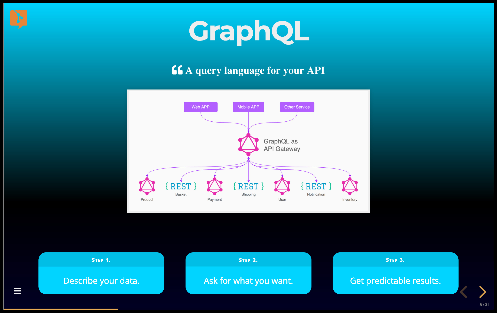

---?image=assets/img/presenter.jpg&opacity=50
@title[Introduction](assets/audio/greeting.mp3)

@snap[west span-100 montserrat-heavy h2-margin-zero]
## git@css[text-gold](pitch).com
@css[text-07](`Modern Slide Decks for Developers`)
@snapend

@snap[south span-100 text-gray text-05]
`This is a GitPitch Audio Slide Deck`
@snapend

---?image=assets/img/presenter.jpg&opacity=50
@title[Snap Layouts](assets/audio/intro.mp3)

@snap[west span-50 montserrat-heavy text-09]
Snap Layouts
@snapend

@snap[east span-50 montserrat-heavy text-center]
@fa[th fa-7x]
 
@css[text-055](3x3 Grid Layout System)
@snapend

---
@title[Simple Syntax](assets/audio/unique.mp3)

@snap[west span-50 montserrat-heavy text-09]
Snap Layouts
@snapend

@snap[north span-35 text-08 montserrat-heavy text-center]
@box
@snapend

@snap[east span-30 text-08 montserrat-heavy text-center]
@box
@snapend

@snap[south span-30 text-08 montserrat-heavy text-center]
@box
@snapend

@snap[midpoint span-30 text-08 montserrat-heavy text-center]
@fa[recycle text-bold fa-2x]
@snapend

---?image=assets/img/grid.jpg&size=88% 92%&color=white
@title[Compass Coordinates](assets/audio/compass.mp3)

@img[span-18](assets/img/compass.png)

---?color=white
@title[Snap Layouts In Action](assets/audio/sample-one.mp3)

@snap[midpoint h3-black span-40]
### GraphQL
@fa[quote-left graphql-quote](A query language for your API)

@snapend

---?color=linear-gradient(90deg, white 50%, black 50%)
@title[Snap Layouts In Action](assets/audio/sample-two.mp3)

@snap[west span-40 h3-black text-center]
### GraphQL
@fa[quote-left graphql-quote](A query language for your API)

@snapend

@snap[north-east span-40 text-08]
@box
@snapend

@snap[east span-40 text-08]
@box
@snapend

@snap[south-east span-40 text-08]
@box
@snapend

---?color=linear-gradient(90deg, white 50%, black 50%)
@title[Snap Layouts In Action](assets/audio/sample-two-color.mp3)

@snap[west span-40 h3-black text-center]
### GraphQL
@fa[quote-left graphql-quote](A query language for your API)

@snapend

@snap[north-east span-40 text-08]
@box[bg-green](Step 1. Schema # Define types using SDL)
@snapend

@snap[east span-40 text-08]
@box[bg-blue](Step 2. Query # Fetch data with Queries)
@snapend

@snap[south-east span-40 text-08]
@box[bg-gold](Step 3. Mutate # Modify data with Mutations)
@snapend

---?color=linear-gradient(180deg, white 50%, #E71E60 50%)
@title[Snap Layouts In Action](assets/audio/sample-three.mp3)

@snap[north span-40 h3-black text-center]
### GraphQL
@fa[quote-left graphql-quote](A query language for your API)
@snapend

@snap[south span-85]
@code[js code-shadow code-max zoom-13](src/js/graphql.js)
@snapend

---?color=linear-gradient(0deg, rgba(2,0,36,1) 0%, rgba(0,0,0,1) 35%, rgba(0,212,255,1) 100%)
@title[Snap Layouts In Action](assets/audio/sample-four.mp3)

@snap[north span-40 text-center]
### GraphQL
@fa[quote-left graphql-quote text-white](A query language for your API)
@snapend

@snap[midpoint span-60]

@snapend

@snap[south-west span-30 text-06]
@box[rounded text-white graphql-box](Step 1.#Describe your data.)
@snapend
@snap[south span-30 text-06]
@box[rounded text-white graphql-box](Step 2.#Ask for what you want.)
@snapend
@snap[south-east span-30 text-06]
@box[rounded text-white graphql-box](Step 3.#Get predictable results.)
@snapend

---?color=linear-gradient(100deg, white 50%, #567AD2 50%)
@title[Snap Layouts In Action](assets/audio/sample-five.mp3)

@snap[west span-40 h3-black text-center]
### GraphQL
@fa[quote-left graphql-quote](A query language for your API)

@snapend

@snap[north-east span-40 text-center]
#### Deployment as a REST API Gateway
@snapend

@snap[south-east span-40]
@uml[bg-white code-shadow](src/uml/graphql.puml)
@snapend

---
@title[Show Me The Code](assets/audio/show-me-code.mp3)

### `Show me the code...`

---
@title[Sample Markdown]

@snap[north span-100 text-gray text-06]
`Sample Slide Markdown`
@snapend

@code[markdown code-reveal-fast code-power zoom-14](src/md/snap-midpoint-sample.md)

@[3-7](assets/audio/basic-markdown.mp3)

---?color=white
@title[Sample Slide](assets/audio/not-quite-right.mp3)

### @color[black](GraphQL)

@fa[quote-left graphql-quote](A query language for your API)

---
@title[Sample Markdown]

@snap[north span-100 text-gray text-06]
`Sample Slide Markdown`
@snapend

@code[markdown code-reveal-fast code-power zoom-14](src/md/snap-midpoint-sample.md)

@[3-7](assets/audio/basic-markdown-again.mp3)
@[1-9](assets/audio/wrap-in-snap-tags.mp3)

---?color=white
@title[Snap Layouts In Action](assets/audio/much-better.mp3)

@snap[midpoint h3-black span-40]
### GraphQL
@fa[quote-left graphql-quote](A query language for your API)

@snapend

---
@title[Basic Syntax](assets/audio/basic-syntax.mp3)

@snap[north span-100 text-gray text-06]
`@snap Layouts Basic Syntax`
@snapend

@code[markdown code-power zoom-24](src/md/snap-layouts-syntax.md)

---
@title[Snap Span Controls](assets/audio/snap-span-property.mp3)

@snap[north span-100 text-gray text-06]
`Sample Slide Markdown`
@snapend

@code[markdown code-power zoom-14](src/md/snap-midpoint-sample.md)

---
@title[Snap Position Controls](assets/audio/snap-position-property.mp3)

@snap[north span-100 text-gray text-06]
`Sample Slide Markdown`
@snapend

@code[markdown code-power zoom-14](src/md/snap-west-sample.md)

---?color=white
@title[Snap Layouts In Action](assets/audio/nice.mp3)

@snap[west h3-black text-center span-40]
### GraphQL
@fa[quote-left graphql-quote](A query language for your API)

@snapend

---
@title[A Quick Detour](assets/audio/quick-detour.mp3)

@img[no-frills span-30](assets/img/tip.png)

### `A quick detour...`

---
@title[Color Delimiter]

@snap[north span-100 text-gray text-06]
`Sample Slide Markdown`
@snapend

@code[markdown code-reveal-fast code-power zoom-11](src/md/color-delim-solid.md)

@[2-11](assets/audio/quick-detour-basic-markdown.mp3)
@[1-11](assets/audio/quick-detour-color-delim.mp3)

---
@title[Color Gradients]

@snap[north span-100 text-gray text-06]
`Sample Slide Markdown`
@snapend

@code[markdown code-reveal-fast code-power zoom-11](src/md/color-delim-gradient.md)

@[2-11](assets/audio/quick-detour-color-options.mp3)
@[1-11](assets/audio/quick-detour-color-gradients.mp3)

---?color=linear-gradient(100deg, white 50%, #567AD2 50%)
@title[Snap Layouts In Action](assets/audio/custom-background-gradient.mp3)

@snap[west span-40 h3-black text-center]
### GraphQL
@fa[quote-left graphql-quote](A query language for your API)

@snapend

---
@title[Complete Design](assets/audio/time-to-complete.mp3)

### `Back to @snap...`

---
@title[Markdown Snippet]

@snap[north span-100 text-gray text-06]
`Sample Slide Markdown`
@snapend

@code[markdown code-reveal-fast code-power zoom-16](src/md/snap-east-sample.md)

@[1-4](assets/audio/add-markdown-snippet.mp3)

---?color=linear-gradient(100deg, white 50%, #567AD2 50%)
@title[Snap Layouts In Action](assets/audio/markdown-heading.mp3)

@snap[west span-40 h3-black text-center]
### GraphQL
@fa[quote-left graphql-quote](A query language for your API)

@snapend

@snap[north-east span-40]
#### Deployment as a REST API Gateway
@snapend

---
@title[Markdown Widgets]

@snap[north span-100 text-gray text-06]
`Sample Slide Markdown`
@snapend

@code[markdown code-reveal-fast code-power zoom-16](src/md/snap-east-sample.md)

@[1-9](assets/audio/markdown-widgets-too.mp3)

---?color=linear-gradient(100deg, white 50%, #567AD2 50%)
@title[Snap Layouts In Action](assets/audio/very-nice.mp3)

@snap[west span-40 h3-black text-center]
### GraphQL
@fa[quote-left graphql-quote](A query language for your API)

@snapend

@snap[north-east span-40]
#### Deployment as a REST API Gateway
@snapend

@snap[south-east span-40]
@uml[bg-white code-shadow](src/uml/graphql.puml)
@snapend

---?color=white
@title[Revisit Markdown]

@snap[north span-100 text-gray text-06]
`Sample Slide Markdown`
@snapend

@code[markdown code-reveal-fast code-blend](src/md/snap-east-west-sample.md)

@[1,2,4-6,10,14](assets/audio/markdown-pre-snap-tags.mp3)
@[1-15](assets/audio/markdown-post-snap-tags.mp3)

---?color=linear-gradient(100deg, white 50%, #567AD2 50%)
@title[Snap Layouts In Action](assets/audio/one-final-time.mp3)

@snap[west span-40 h3-black text-center]
### GraphQL
@fa[quote-left graphql-quote](A query language for your API)

@snapend

@snap[north-east span-40]
#### Deployment as a REST API Gateway
@snapend

@snap[south-east span-40]
@uml[bg-white code-shadow](src/uml/graphql.puml)
@snapend

---?color=white
@title[Best of Both Worlds](assets/audio/best-of-both-worlds.mp3)

@snap[north-west span-30]

@snapend

@snap[north-east span-30]

@snapend

@snap[midpoint span-60]

@snapend

@snap[south-west span-30 z-neg-100]

@snapend

@snap[south-east span-30 z-neg-100]

@snapend

---?image=assets/img/presenter.jpg&opacity=20
@title[Snap Layouts Guide](assets/audio/conclusion.mp3)

@snap[west span-35]
@fa[book-reader fa-7x]
@css[text-05](Learn More in the GitPitch Docs)
@snapend

@snap[east span-65]
@css[text-06](`Modern Slide Decks for Developers`)
 
[Snap Layouts Guide @fa[external-link]](https://gitpitch.com/docs/layout-features/snap-layouts)
@snapend
